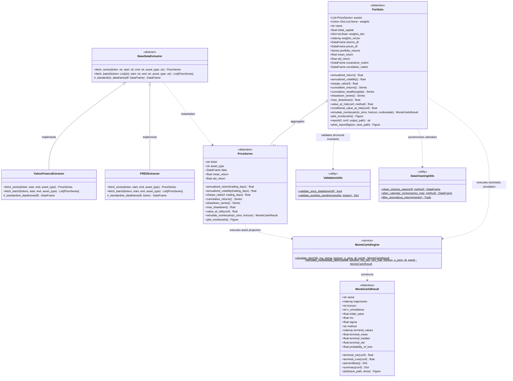
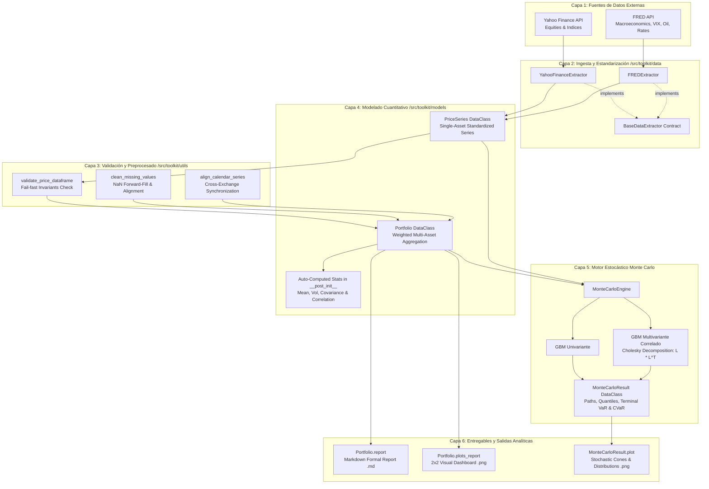

# Arquitectura y Diagramas del Sistema — Toolkit BME-MIAX (T1)

> **MIAX - Máster en Inteligencia Artificial Aplicada a Mercados Financieros (BME)**  
> Bloque B1 · Taller 1: Arquitectura, Ingesta Multifuente, Modelado de Carteras, Simulación Monte Carlo y Reportes

---

## 1. Diagrama de Clases UML y Jerarquía de Dependencias

El siguiente diagrama formal representa la jerarquía orientada a objetos, las relaciones de agregación y las dependencias del toolkit:

---

## 2. Diagrama de Flujo de Datos y Arquitectura por Capas

El flujo de procesamiento desde las fuentes externas hasta los entregables cuantitativos finales:

---

## 3. Principios de Diseño y Decisiones Arquitectónicas

1. **Desacoplamiento Estricto (Separation of Concerns)**:
   - La capa de extracción (`data/`) no conoce la lógica de carteras ni los motores de simulación. Solo descarga y devuelve instancias normalizadas de `PriceSeries`.
   - La capa de modelado (`models/`) trabaja con abstracciones independientes del proveedor de datos original.

2. **Interoperabilidad Universal vía DataClasses**:
   - Tanto una acción del Nasdaq (`AAPL`), un índice español (`^IBEX`) o una serie macroeconómica de la Fed (`DFF`, `VIXCLS`) se modelan de forma idéntica dentro de `PriceSeries`.

3. **Política de Validación *Fail-Fast***:
   - Se imponen invariantes estrictos (orden cronológico estricto, índices temporales sin duplicados, precios estrictamente positivos $> 0$) para evitar silenciamiento de errores cuantitativos en matrices de covarianza o divisiones entre cero.

4. **Sincronización Multicalendario**:
   - Resuelve de manera determinista la discrepancia entre días hábiles de diferentes plazas financieras mediante intersección estricta (`'inner'`) o unión con arrastre de cotización (`'outer_ffill'`).

5. **Simulación Estocástica Parametrizable**:
   - Admite difusión univariante analítica o difusión multivariante correlada completa basada en descomposición de Cholesky de la covarianza empírica, preservando la estructura de dependencias empíricas.

